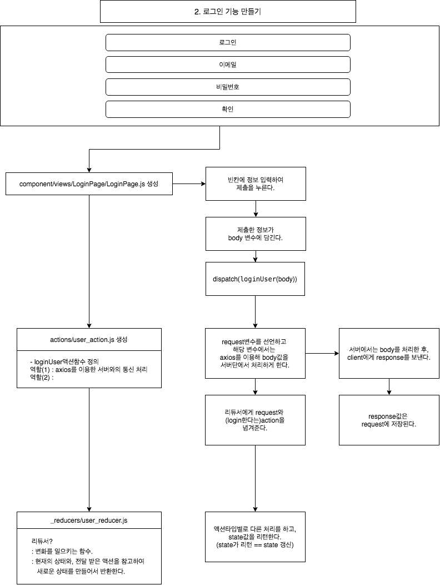

# 2. react로 프론트엔드 개발하기(1)
*이 내용은 인프런의 '따라하며 배우는 노드 리액트 기초 강의'를 학습한 자료입니다.*




## 1) 사전 설정
### (1) 라이브러리 설치하기
#### CREATE-REACT-APP
- 과거, 리액트 앱을 실행시 `webpack`, `babel` 초기설정을 해야했다.
- 하지만, 하지만 이제는 `create-react-app Command`로 바로 시작할수 있다.

- `바벨?` 최신 자바스크립트 문법을 지원하지 않는 브라우저들을 위해서 최신 자바스크립트 문법을 구형 브라우저에서도 돌수있게 변환 시켜준다.
- `웹팩?` 웹사이트를 만들 때, js파일뿐만 아니라 여러 라이브러리를 씀 -> 이러한 여러 종류의 라이브러리, 프레임워크를 웹팩을 이용하여 묶어준다.

- 원래  `create-react-app`을 하면, `global` 디렉토리에 다운받는다.
- `npx create-react-app`을 하면 Disk Space를 낭비하지 않을수 있고, 항상 최신 버전을 사용할수 있다. 
```
npx install create-react-app
```

<br/>

#### REACT-ROUTER-DOM

- 페이지 이동을 할때 React Router Dom 이라는 것을 사용한다.

 https://reacttraining.com/react-router/web/example/basic

```
npm install react-router-dom --save
```

<br/>

#### AXIOS

-  React에서  Request를 보낼 때 AXIOS를 사용한다. 

```
npm install axios --save
```

<br/>

#### AXIOS

- 현재 프론트는 3000번 포트, 백엔드는 5000번 포트이다.

-  두개의 다른 포트를 가지고 있는 서버는 아무 설정없이 Request를  보낼수 없다.

- 그 이유는, Cors 정책, Cross-Origin Resource Sharing (CORS) 보안 때문이다.

- 그래서 우리는 proxy-server 설정을 사용하여, 서로다른 포트간의 통신을 가능하게 한다.


```
npm install axios --save
```

<br/>


### (2) 폴더 생성하기
 
 - 프로젝트를 진행할 폴더를 생성한다.
```
mkdir boiler-plate
cd boiler-plate

//--save라고 하면 package.json에 라이브러리 버전이 저장됨
//다운받은 모든 라이브러리는 node_module에 들어가 있음
```
 
 ### (3)npm 패키지 만들기
 
 - `npm init`명령어를 사용하여 `package.json`만든다.
 
 
 ### (4) 백엔드의 시작점 만들기
 
 - index.js은 백엔드의 시작점으로, 루트 디렉토리에 생성한다.
 
 ```js
const express = require('express')   //express 불러오기
const app = express()                //express를 사용하겠다.
const port = 5000                    //포트넘버

app.get('/', (req, res) => {        //app.get(end_point, (request, response))
  res.send('Hello World!')
})

app.listen(port, () => {
  console.log(`Example app listening at http://localhost:${port}`)
})
 ```
 
 ### (5) package.json에 추가하기
 
- package.json에 `start : node index.js` 추가한다.
```
npm run start
```
