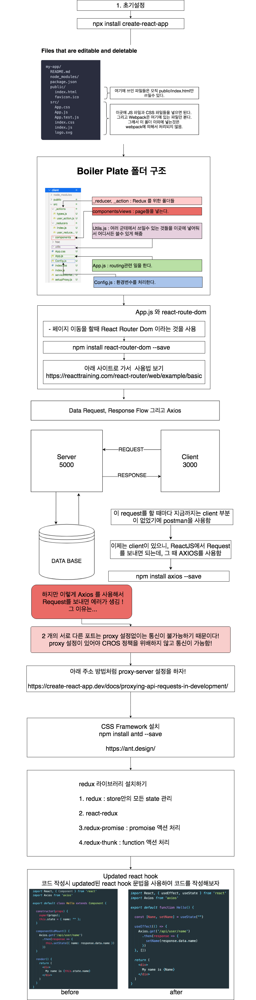

# 2. react로 프론트엔드 개발하기(1)
*이 내용은 인프런의 '따라하며 배우는 노드 리액트 기초 강의'를 학습한 자료입니다.*




## 1) 사전 설정
### (1) 라이브러리 설치하기
#### CREATE-REACT-APP
- 과거, 리액트 앱을 실행시 `webpack`, `babel` 초기설정을 해야했다.
- 하지만, 하지만 이제는 `create-react-app Command`로 바로 시작할수 있다.

- `바벨?` 최신 자바스크립트 문법을 지원하지 않는 브라우저들을 위해서 최신 자바스크립트 문법을 구형 브라우저에서도 돌수있게 변환 시켜준다.
- `웹팩?` 웹사이트를 만들 때, js파일뿐만 아니라 여러 라이브러리를 씀 -> 이러한 여러 종류의 라이브러리, 프레임워크를 웹팩을 이용하여 묶어준다.

- 원래  `create-react-app`을 하면, `global` 디렉토리에 다운받는다.
- `npx create-react-app`을 하면 Disk Space를 낭비하지 않을수 있고, 항상 최신 버전을 사용할수 있다. 
```
npx install create-react-app
```

<br/>

#### REACT-ROUTER-DOM

- 페이지 이동을 할때 React Router Dom 이라는 것을 사용한다.

 https://reacttraining.com/react-router/web/example/basic

```
npm install react-router-dom --save
```

<br/>

#### AXIOS

-  React에서  Request를 보낼 때 AXIOS를 사용한다. 

```
npm install axios --save
```

<br/>

#### PROXY

- 현재 프론트는 3000번 포트, 백엔드는 5000번 포트이다.

-  두개의 다른 포트를 가지고 있는 서버는 아무 설정없이 Request를  보낼수 없다.

- 그 이유는, Cors 정책, Cross-Origin Resource Sharing (CORS) 보안 때문이다.

- 그래서 우리는 proxy-server 설정을 사용하여, 보안정책에 위배되지 않게 포트간 통신을 가능하게 한다.


```
$ npm install http-proxy-middleware --save
$ # 또는
$ yarn add http-proxy-middleware
```

- `src/setupProxy.js`을 만들어 아래 코드를 작성한다.
https://www.inflearn.com/questions/28710
```jsx
const {createProxyMiddleware} = require('http-proxy-middleware');
module.exports = function(app) {
  app.use(  
  '/api', 
  createProxyMiddleware({
  target: 'http://localhost:5000',
  changeOrigin: true,
  })
 );
};
```

<br/>

#### REDUX

- 리덕스는 스토어안의 모든 `state`을 관리한다.
- 스토어 안의 `state`을 변경하고 싶다면 -> `dispatch`을 이용하여 `action`으로 변경한다.
-액션은 무조건 객체형태여야한다.
- 하지만 `store`에서는 항상 객체 형태의 액션이 아닌 `promise`형태 혹은 `function`형태의 액션을 받을 때가 있다.
- 그래서 이 두 가지를 처리하기 위해 `redux-promise`, `thunk`을 미들웨어로 써야 한다.

- `redux-thunk`의 경우, dispatch에게 어떻게 function을 받는지에 대한 방법을 알려준다.
- `redux-promise`는 dispatch에게 어떻게 promise형태의 액션을 받는지에 대한 방법을 알려준다.

```
$ npm i redux react-redux redux-promise redux-thunk --save 
```

<br/>

### (2) 폴더 생성하기

- `_actions`, `_reducer` : Redux 를 위한 폴더들이다.

- `components/views` : 이 안에는 Page들을 넣는다.

- `components/views/Sections` : 이 안에는 해당 페이지에 관련된 css 파일이나, component 들을 넣는다.

- `App.js` : Routing 관련 일을 처리한다.

- `Config.js` : 환경 변수같은 것들을 정하는 곳이다.


<br/><br/><br/>

-----

#### node를 이용하여 backend 구축하기

- <a href="https://github.com/KumJungMin/boiler-plate/blob/master/descri/node1.md"> 사전설정하기 </a>

- <a href="https://github.com/KumJungMin/boiler-plate/blob/master/descri/node2.md"> 회원가입만들기 </a>

- <a href="https://github.com/KumJungMin/boiler-plate/blob/master/descri/node3.md"> 비밀번호 암호화하기 </a>

- <a href="https://github.com/KumJungMin/boiler-plate/blob/master/descri/node4.md"> 로그인 기능 만들기 </a>

- <a href="https://github.com/KumJungMin/boiler-plate/blob/master/descri/node5.md"> 권한설정 하기 </a>

- <a href="https://github.com/KumJungMin/boiler-plate/blob/master/descri/node6.md"> 로그아웃만들기 </a>

<br/>

#### react를 이용하여 frontend 구축하기

- <a href="https://github.com/KumJungMin/boiler-plate/blob/master/descri/fro/react1.md"> 사전설정하기 </a>

- <a href="https://github.com/KumJungMin/boiler-plate/blob/master/descri/fro/react2.md"> 로그인만들기 </a>

- <a href="https://github.com/KumJungMin/boiler-plate/blob/master/descri/fro/react3.md"> 회원가입만들기 </a>

- <a href="https://github.com/KumJungMin/boiler-plate/blob/master/descri/fro/react4.md"> 로그아웃만들기 </a>

- <a href="https://github.com/KumJungMin/boiler-plate/blob/master/descri/fro/react5.md"> 인증만들기 </a>
