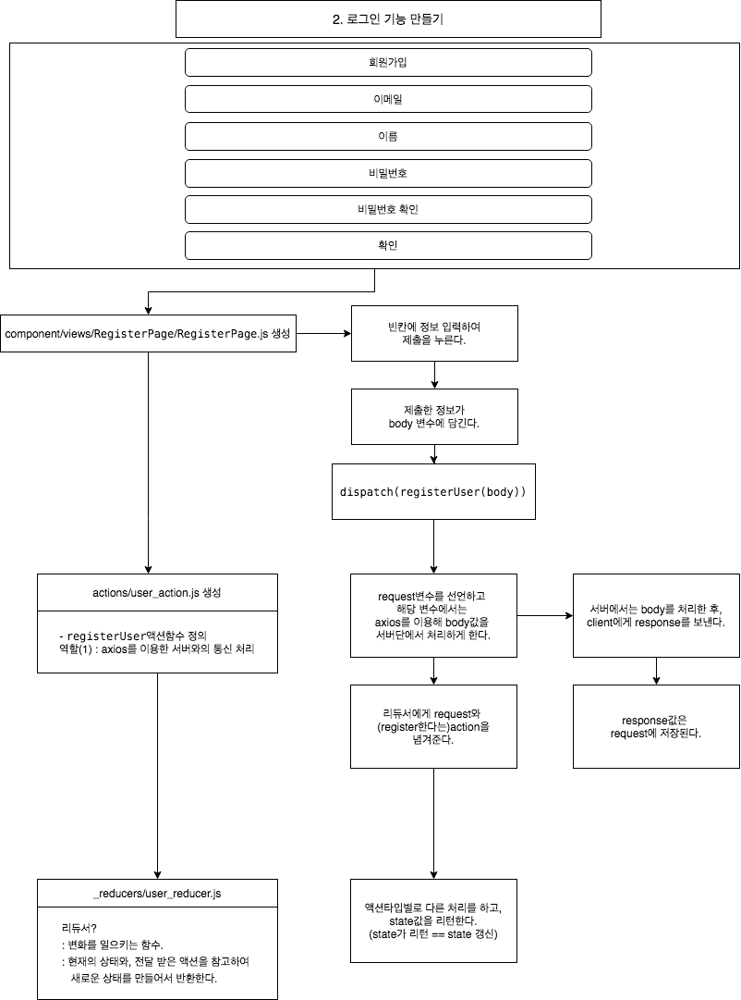

# 2. react로 프론트엔드 개발하기(2), 회원가입 기능
*이 내용은 인프런의 '따라하며 배우는 노드 리액트 기초 강의'를 학습한 자료입니다.*




## 1) RegisterPage.js 생성

- (1) `useState` : state의 변화를 주기 위해 사용한다.
- (2) `useDispatch` : redux를 이용하여 서버와 통신을 위해 라이브러리를 가져온다.
- (3) `registerUser` : axios처리와 reducer에게 state, action을 보내는 함수
- (4) `withRouter` : withRouter를 사용하면 컴포넌트 프로퍼티로 라우터의 history를 얻을 수 있다.
```js
import React, { useState } from 'react'                               //(1)
import { useDispatch } from 'react-redux';                            //(2)
import { registerUser } from '../../../_actions/user_action';         //(3)
import Axios from 'axios';
import { withRouter } from 'react-router-dom';                        //(4)

function RegisterPage(props) {
    const dispatch = useDispatch();

    const [Email, setEmail] = useState("")
    const [Name, setName] = useState("")
    const [Password, setPassword] = useState("")
    const [ConfirmPassword, setConfirmPassword] = useState("")


    const onEmailHandler = (event) => {
        setEmail(event.currentTarget.value)
    }

    const onNameHandler = (event) => {
        setName(event.currentTarget.value)
    }

    const onPasswordHandler = (event) => {
        setPassword(event.currentTarget.value)
    }

    const onConfirmPasswordHandler = (event) => {
        setConfirmPassword(event.currentTarget.value)
    }

    const onSubmitHandler = (event) => {
        event.preventDefault();

        if (Password !== ConfirmPassword) {
            return alert('비밀번호와 비밀번호 확인은 같아야 합니다.')
        }

        let body = {
            email: Email,
            password: Password,
            name: Name
        }
        dispatch(registerUser(body))
            .then(response => {
                if (response.payload.success) {
                    props.history.push("/login")
                } else {
                    alert("Failed to sign up")
                }
            })
      }


    return (
        <div style={{
            display: 'flex', justifyContent: 'center', alignItems: 'center'
            , width: '100%', height: '100vh'
        }}>
            <form style={{ display: 'flex', flexDirection: 'column' }}
                onSubmit={onSubmitHandler}
            >
                <label>Email</label>
                <input type="email" value={Email} onChange={onEmailHandler} />

                <label>Name</label>
                <input type="text" value={Name} onChange={onNameHandler} />

                <label>Password</label>
                <input type="password" value={Password} onChange={onPasswordHandler} />

                <label>Confirm Password</label>
                <input type="password" value={ConfirmPassword} onChange={onConfirmPasswordHandler} />

                <br />
                <button type="submit">
                    회원 가입
                </button>
            </form>
        </div>
    )
}

export default withRouter(RegisterPage)

```

<br/>


## 3) action 만들기

### (1) action/user_action.js
- 액션함수 만든다.

- (1) `registerUser(dataToSubmit))` : dataToSubmit에는 객체형태의 {email,pw}값이 들어옴|body

- (2) `axios.post('/api/users/register', dataToSubmit)` : 액션함수 내에서 axios를 통한 서버와의 통신을 처리한다.

- (3) `return{type :..., payload:...}` : 리듀서는 현재의 상태와 전달 받은 액션을 참고하여 새로운 상태를 만들어서 반환한다.

```js
...
export function registerUser(dataToSubmit) {                        //(1)

    const request = axios.post('/api/users/register', dataToSubmit) //(2)
        .then(response => response.data)

    return {
        type: REGISTER_USER,                                        //(3)
        payload: request
    }
}
```
<br/>

## 4) reducer 만들기
### (1) reducer/user_reducer.js
- 액션의 타입별로 다른 조치를 취하게 한다.

- (1) `switch (action.type)`: action 폴더에 types.js안에 액션이름들을 정의되어 있다.
```js
import {
    LOGIN_USER,
    REGISTER_USER,
    AUTH_USER
} from '../_actions/types';

export default function(state={}, action){
    switch (action.type){                         //(1)
        case LOGIN_USER:
            return {...state, loginSuccess : action.payload}   
            break;
        case REGISTER_USER:
            return { ...state, register: action.payload }
            break;
        case AUTH_USER:
            return { ...state, userData: action.payload }
            break;
        default:
            return state;
    }
}
```


<br/><br/><br/>

-----

#### node를 이용하여 backend 구축하기

- <a href="https://github.com/KumJungMin/boiler-plate/blob/master/descri/node1.md"> 사전설정하기 </a>

- <a href="https://github.com/KumJungMin/boiler-plate/blob/master/descri/node2.md"> 회원가입만들기 </a>

- <a href="https://github.com/KumJungMin/boiler-plate/blob/master/descri/node3.md"> 비밀번호 암호화하기 </a>

- <a href="https://github.com/KumJungMin/boiler-plate/blob/master/descri/node4.md"> 로그인 기능 만들기 </a>

- <a href="https://github.com/KumJungMin/boiler-plate/blob/master/descri/node5.md"> 권한설정 하기 </a>

- <a href="https://github.com/KumJungMin/boiler-plate/blob/master/descri/node6.md"> 로그아웃만들기 </a>

<br/>

#### react를 이용하여 frontend 구축하기

- <a href="https://github.com/KumJungMin/boiler-plate/blob/master/descri/fro/react1.md"> 사전설정하기 </a>

- <a href="https://github.com/KumJungMin/boiler-plate/blob/master/descri/fro/react2.md"> 로그인만들기 </a>

- <a href="https://github.com/KumJungMin/boiler-plate/blob/master/descri/fro/react3.md"> 회원가입만들기 </a>

- <a href="https://github.com/KumJungMin/boiler-plate/blob/master/descri/fro/react4.md"> 로그아웃만들기 </a>

- <a href="https://github.com/KumJungMin/boiler-plate/blob/master/descri/fro/react5.md"> 인증만들기 </a>
