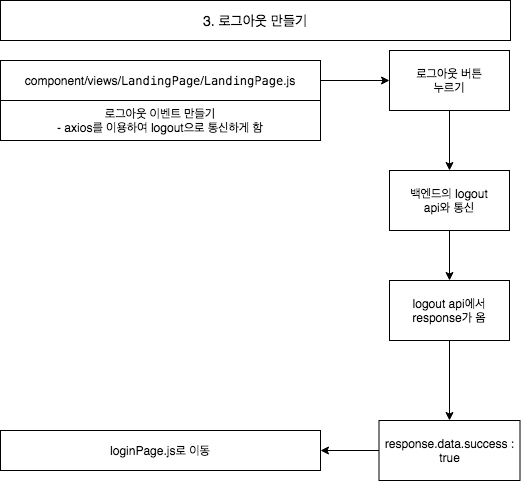

# 2. react로 프론트엔드 개발하기(3), 로그아웃 기능
*이 내용은 인프런의 '따라하며 배우는 노드 리액트 기초 강의'를 학습한 자료입니다.*




## 1) LandingPage.js 생성
- (1) `<button onClick={onClickHandler}>` : 로그아웃 버튼을 만든다.
- (2) `axios.get(`/api/users/logout`)` : 로그아웃 버튼 클릭시 axios를 통해 통신하게 한다.
- (3) `props.history.push("/login")` : 로그아웃 성공시 login페이지로 redirect한다.

```js
import React, { useEffect } from 'react'
import axios from 'axios';
import { withRouter } from 'react-router-dom'; 
function LandingPage(props) {

    useEffect(() => {
        axios.get('/api/hello')
            .then(response => { console.log(response) })
    }, [])


    const onClickHandler = () => {
        axios.get(`/api/users/logout`)                    //(2)
            .then(response => { 
                if (response.data.success) {  
                    props.history.push("/login")          //(3)
                } else {
                    alert('로그아웃 하는데 실패 했습니다.')
                }
            })
    }

    return (
        <div style={{
            display: 'flex', justifyContent: 'center', alignItems: 'center'
            , width: '100%', height: '100vh'
        }}>
            <h2>시작 페이지</h2>

            <button onClick={onClickHandler}>             //(1)
                로그아웃
            </button>

        </div>
    )
}

export default withRouter(LandingPage)
```


<br/><br/><br/>

-----

#### node를 이용하여 backend 구축하기

- <a href="https://github.com/KumJungMin/boiler-plate/blob/master/descri/node1.md"> 사전설정하기 </a>

- <a href="https://github.com/KumJungMin/boiler-plate/blob/master/descri/node2.md"> 회원가입만들기 </a>

- <a href="https://github.com/KumJungMin/boiler-plate/blob/master/descri/node3.md"> 비밀번호 암호화하기 </a>

- <a href="https://github.com/KumJungMin/boiler-plate/blob/master/descri/node4.md"> 로그인 기능 만들기 </a>

- <a href="https://github.com/KumJungMin/boiler-plate/blob/master/descri/node5.md"> 권한설정 하기 </a>

- <a href="https://github.com/KumJungMin/boiler-plate/blob/master/descri/node6.md"> 로그아웃만들기 </a>

<br/>

#### react를 이용하여 frontend 구축하기

- <a href="https://github.com/KumJungMin/boiler-plate/blob/master/descri/fro/react1.md"> 사전설정하기 </a>

- <a href="https://github.com/KumJungMin/boiler-plate/blob/master/descri/fro/react2.md"> 로그인만들기 </a>

- <a href="https://github.com/KumJungMin/boiler-plate/blob/master/descri/fro/react3.md"> 회원가입만들기 </a>

- <a href="https://github.com/KumJungMin/boiler-plate/blob/master/descri/fro/react4.md"> 로그아웃만들기 </a>

- <a href="https://github.com/KumJungMin/boiler-plate/blob/master/descri/fro/react5.md"> 인증만들기 </a>
