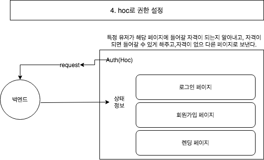

# 2. react로 프론트엔드 개발하기(4), 권한 기능
*이 내용은 인프런의 '따라하며 배우는 노드 리액트 기초 강의'를 학습한 자료입니다.*




## 0)Hoc로 권한설정?

- `Hoc(higherOrderCompoenent)`은 함수이며 다른 컴포넌트를 받아 -> 새로운 컴포넌트를 리턴한다.

- `auth`가 `hoc`이고, 다른 컴포넌트(로그인, 렌딩, 회원가입 페이지)를 다 집어넣는다.

- `auth`에서 먼저 `backend`에 request를 보냄 -> 현재 특정 페이지에 들어와 있는 사용자의 상태정보(어드민인지, 로그인 되어있는지 등)를 가져온다.

- 만약 사용자가 특정페이지에 못 들어가는 권한자이면 -> `auth`에서 다른 곳으로 사용자를 보내는 원리이다.

- 로그인 페이지에 사용자가 들어옴 -> `auth`가 사용자의 정보를 요청 -> 해당 사용자는 비로그인상태 -> `auth`에서 사용자가 로그인 페이지에 있어도 된다고 판단하여 둠


## 1) hoc/auth.js 생성

- (1) `function (.., option, ..)` : null(아무나 출입가능),  true(로그인 유저만), false(로그인 유저는 출입불가능)라는 옵션이 있음

- (1-1) `function (.., .., adminRouter = null)` :  어드민 유저만 들어가길 원하는 페이지면 -> true라고 함

- (2)  `dispatch(auth()).then(..` : 백엔드에 request를 날려서, 현재 사용자의 상태정보를 받는다. 

- (2-1) `dispatch(auth())` : dispatch로 액션을 리듀서에게 날림  

- (2-2) `response` : response에서는 백엔드api에서 처리하고 clinet에게 보낸 정보가 들어있음, reponse정보를 이용하여 분기처리를 진행.

```js
import React, {useEffect} from 'react';
import Axios from 'axios';
import {useDispatch} from 'react-redux';
import {auth} from '../_actions/user_action'

export default function (SpecificComponent, option, adminRouter = null){     //(1) (1-1)
   
    function AuthenticationCheck(props){
        const dispatch = useDispatch();
        useEffect(()=>{                                                     //(2)
            //dispatch로 액션을 리듀서에게 날림  
            dispatch(auth()).then(response=>{                               //(2-1) (2-2)

                // 로그인하지 않은 상태
                if(!response.payload.isAuth){
                    if(option){  //option==true -> 로그인한 유저만 출입가능한 곳에 접근할시
                        props.history.push('/login'); //로그인페이지로 보내버림
                    }

                }else{
                    // 로그인한 상태
                    if(adminRouter && !response.payload.isAdmin){
                        // 어드민만 들어갈 수 잇는 페이지에 && 어드민이 아닌 사람이 들어온다면?
                        props.history.push('/'); 
                    }else{
                        if(option == false){
                            // 로그인한 유저가 로그인하지 않은 유저가 들어갈 수 있는 페이지(ㅚ원가입, 로그인)에 들어가려고 할 떄
                            props.history.push('/'); 
                        }
                    }
                }
            })            
            // node auth에서는 middleware에 auth함수가 있음
            //해당 함수에서 토큰을 발행하고 인증처리함-> 그리고 client에게 인증여부를 보냄
            // Axios.get('/api/users/auth')          
        })
        return(
            <SpecificComponent/>
        );
    }

    return AuthenticationCheck
}
```

<br/>

## 2) user_action에서 auth액션함수 생성
```js
export function auth() {

    const request = axios.get('/api/users/auth')
        .then(response => response.data)

    return {
        type: AUTH_USER,
        payload: request
    }
}
```

<br/>

## 2) user_reducer에 auth 액션 추가
```js
import {
    LOGIN_USER,
    REGISTER_USER,
    AUTH_USER
} from '../_actions/types';

export default function(state={}, action){
    switch (action.type){
        ...
        case AUTH_USER:
            return { ...state, userData: action.payload }
            break;
        default:
            return state;
    }
}
```

<br/>

## 3) app.js

- `app.js`에 가서 -> 모든 컴포넌트들을 `hoc`안에 넣는다.(적용)

```js
import React from 'react';
import './App.css';
import {BrowserRouter as Router, Switch, Route, Link} from 'react-router-dom';
import LandingPage from './components/views/LandingPage/LandingPage'
import LoginPage from './components/views/LoginPage/LoginPage'
import RegisterPage from './components/views/RegisterPage/RegisterPage'
// hoc적용하기
import Auth from './hoc/auth'

function App() {
  return (
    <div className="App">
      <Router>
          <Switch>
            {/* component를 auth로 감싸주는 됨 
            function (SpecificComponent, option, adminRouter = null)
            
            Auth(컴포넌트, 옵션, 어드민유무) */}
            {/* <Route exact path="/"><LandingPage/></Route> */}
            <Route exact path="/" component={Auth(LandingPage, null)}></Route>
            <Route exact path="/login" component={Auth(LoginPage, false)}></Route>
            <Route exact path="/register" component={Auth(RegisterPage, false)}></Route>
            {/* <Route exact path="/login"><LoginPage/></Route>
            <Route exact path="/register"><RegisterPage/></Route> */}
          </Switch>  
      </Router>      
    </div>
  );
}

export default App;

```


<br/><br/><br/>

-----

#### node를 이용하여 backend 구축하기

- <a href="https://github.com/KumJungMin/boiler-plate/blob/master/descri/node1.md"> 사전설정하기 </a>

- <a href="https://github.com/KumJungMin/boiler-plate/blob/master/descri/node2.md"> 회원가입만들기 </a>

- <a href="https://github.com/KumJungMin/boiler-plate/blob/master/descri/node3.md"> 비밀번호 암호화하기 </a>

- <a href="https://github.com/KumJungMin/boiler-plate/blob/master/descri/node4.md"> 로그인 기능 만들기 </a>

- <a href="https://github.com/KumJungMin/boiler-plate/blob/master/descri/node5.md"> 권한설정 하기 </a>

- <a href="https://github.com/KumJungMin/boiler-plate/blob/master/descri/node6.md"> 로그아웃만들기 </a>

<br/>

#### react를 이용하여 frontend 구축하기

- <a href="https://github.com/KumJungMin/boiler-plate/blob/master/descri/fro/react1.md"> 사전설정하기 </a>

- <a href="https://github.com/KumJungMin/boiler-plate/blob/master/descri/fro/react2.md"> 로그인만들기 </a>

- <a href="https://github.com/KumJungMin/boiler-plate/blob/master/descri/fro/react3.md"> 회원가입만들기 </a>

- <a href="https://github.com/KumJungMin/boiler-plate/blob/master/descri/fro/react4.md"> 로그아웃만들기 </a>

- <a href="https://github.com/KumJungMin/boiler-plate/blob/master/descri/fro/react5.md"> 인증만들기 </a>
