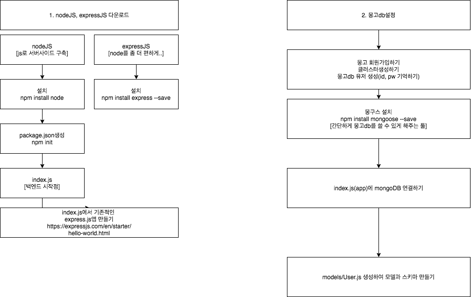

# 1. node로 백엔드 개발하기(1)
*이 내용은 인프런의 '따라하며 배우는 노드 리액트 기초 강의'를 학습한 자료입니다.*



## 1) 사전 설정
### (1) node, express설치하기

- nodeJS는 JS를 서버사이드에서 쓸 수 있게한 언어이다.
- express.js는 node를 이용하여 어플리케이션을 만드는, nodeJS를 쉽게 이용할 수 있게 해주는 프레임워크이다.
```
npm install node express --save

//--save라고 하면 package.json에 라이브러리 버전이 저장됨
//다운받은 모든 라이브러리는 node_module에 들어가 있음
```

### (2) 폴더 생성하기
 
 - 프로젝트를 진행할 폴더를 생성한다.
```
mkdir boiler-plate
cd boiler-plate
```
 
 ### (3)npm 패키지 만들기
 
 - `npm init`명령어를 사용하여 `package.json`만든다.
 
 
 ### (4) 백엔드의 시작점 만들기
 
 - index.js은 백엔드의 시작점으로, 루트 디렉토리에 생성한다.
 
 ```js
const express = require('express')   //express 불러오기
const app = express()                //express를 사용하겠다.
const port = 5000                    //포트넘버

app.get('/', (req, res) => {        //app.get(end_point, (request, response))
  res.send('Hello World!')
})

app.listen(port, () => {
  console.log(`Example app listening at http://localhost:${port}`)
})
 ```
 
 ### (5) package.json에 추가하기
 
- package.json에 `start : node index.js` 추가한다.
```
npm run start
```

<br/>

## 2) 몽고DB 연결하기
### (1) 몽고db란?

- JSON 형식의 데이터구조
- CRUD위주의 다중 트랜잭션 처리 가능
- Memory Mapping기술을 기반으로 빅데이터 처리에 성능이 탁월

### (2) 몽고db 생성하기
- 몽고db 사이트에 가서 회원가입하기
- 클러스터 생성하기(클러스터란, 데이터 저장소)
- 몽고db 유저 생성(id, pw 꼭 기억하기)

- 몽구스 설치하기(몽고db를 편하게 쓰게 해주는 툴)
```
npm install mongoose --save
```

### (3)app에 몽고db연결하기(index.js)

- index.js파일로 가서, 몽구스 모듈을 불러온다.
- mongoose.connect에 몽고db 웹 연결키를 작성해준다.

```js
const express = require('express')   //express모듈 가져오기
const app = express()                //새로운 express 앱 생성
const port = 5000                    //포트번호
const mongoose = require('mongoose');//몽구스 모듈 가져오기

mongoose.connect('몽고db 웹 연결 키',{
    useNewUrlParser : true, 
    useUnifiedTopology : true, 
    useCreateIndex : true, 
    useFindAndModify : false
}).then(()=>console.log("mongoDB is connected"))
.catch((err)=> console.log("failed", err))
// then 연결이 잘 됐는지 확인
//catch 오류가 있을 시


app.get('/', (req, res) => {        //app에 /루트디렉토리로 오면 -> 화면에 출력
  res.send('Hello World!,asa')
})

app.listen(port, () => {            //5000번 포트에서 실행
  console.log(`Example app listening at http://localhost:${port}`)
})

```

<br/>

## 3) db 구축하기

- model은 스키마를 감싸주는 역할을 한다.
- 스키마는 데이터에 대한 형식을 규정한다.

### (1) 모델 파일 생성하기
- bolier-plate > models > User.js 생성한다.
- User.js는 모델에 대한 정의를 하는 파일이다.

```js
//모델, 스키마 구축하기
// 1. 몽구스 가져오기
const mongoose = require('mongoose');

// 2. 스키마 생성
const userSchema = mongoose.Schema({
    name : {
        type : String,
        maxlength : 30
    }, 
    email : {
        type : String,
        trim : true, //스페이스를 없애주는 역할 rma 12@naver.com -> rma12@naver.com
        unique : 1   //email이 유니크키
    },
    password : {
        type : String,
        minlength : 5
    },
    lastname : {
        type : String, 
        maxlength : 50
    },
    role:{
        //어떤 유저가 관리자, 일반 유저가 될 수 있으므로 역할을 줌
        //number : 1 관리자 / 0이면 일반유저
        type : Number,
        default : 0 //만약 숫자를 부여하지 않으면 기본으로 0을 할당
    },
    image : String,
    token : {
        //토큰을 사용하여 유효성을 관리함
        type : String
    },
    tokenExp : {
        // 토큰의 유효기간
        type : Number 
    }
})


// 3. 생성된 스키마를 모델로 감싸준다. (모델명, 스키마)
const User = mongoose.model('User', userSchema)

// 4. 이 모델을 다른 곳에서도 쓸 수 있게 export
module.exports = {User}
```


<br/><br/><br/>

-----

#### node를 이용하여 backend 구축하기

- <a href="https://github.com/KumJungMin/boiler-plate/blob/master/descri/node1.md"> 사전설정하기 </a>

- <a href="https://github.com/KumJungMin/boiler-plate/blob/master/descri/node2.md"> 회원가입만들기 </a>

- <a href="https://github.com/KumJungMin/boiler-plate/blob/master/descri/node3.md"> 비밀번호 암호화하기 </a>

- <a href="https://github.com/KumJungMin/boiler-plate/blob/master/descri/node4.md"> 로그인 기능 만들기 </a>

- <a href="https://github.com/KumJungMin/boiler-plate/blob/master/descri/node5.md"> 권한설정 하기 </a>

- <a href="https://github.com/KumJungMin/boiler-plate/blob/master/descri/node6.md"> 로그아웃만들기 </a>

<br/>

#### react를 이용하여 frontend 구축하기

- <a href="https://github.com/KumJungMin/boiler-plate/blob/master/descri/fro/react1.md"> 사전설정하기 </a>

- <a href="https://github.com/KumJungMin/boiler-plate/blob/master/descri/fro/react2.md"> 로그인만들기 </a>

- <a href="https://github.com/KumJungMin/boiler-plate/blob/master/descri/fro/react3.md"> 회원가입만들기 </a>

- <a href="https://github.com/KumJungMin/boiler-plate/blob/master/descri/fro/react4.md"> 로그아웃만들기 </a>

- <a href="https://github.com/KumJungMin/boiler-plate/blob/master/descri/fro/react5.md"> 인증만들기 </a>
