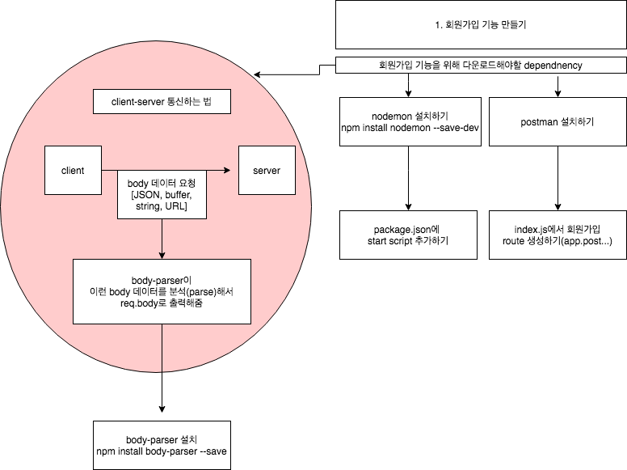

# 1. node로 백엔드 개발하기(2)
*이 내용은 인프런의 '따라하며 배우는 노드 리액트 기초 강의'를 학습한 자료입니다.*



## 1) 회원가입 기능 만들기
- 회원가입 기능을 만들기 전, 필요한 모듈을 설치한다.

### (1) body-parser 설치하기

- bodyparser는 클라이언트에서 오는 정보(body data)를 -> 서버에서 분석하여 가져올 수 있게 한다.
- body data는 req.body로 출력가능하다.

```js
npm install body-parser --save
```

```js
//index.js
const express = require('express')        
const app = express()                     
const port = 5000                         
const {User} = require("./models/User");  //회원가입 라우터 만들기 : 모델 가져오기
const bodyParser = require('body-parser');//회원가입 라우터 만들기 : border-parser가져오기

// bodyparser는 클라이언트에서 오는 정보를 -> 서버에서 분석하여 가져올 수 있게 함
//aplication/x-www-form-urlencoded 이러한 형태의 데이터를 분석해서 가져올 수 있게 함
app.use(bodyParser.urlencoded({extended : true}));

//aplication/json 타입의 데이터를 분석하여 가져올 수 있게 함 
app.use(bodyParser.json());

const mongoose = require('mongoose');
mongoose.connect(config.mongoURI,{
    useNewUrlParser : true, useUnifiedTopology : true, useCreateIndex : true, useFindAndModify : false
}).then(()=>console.log("mongoDB is connected"))
.catch((err)=> console.log("failed", err))


// 회원가입을 위한 라우터 만들기
// :회원가입할 때 필요한 정보들을 클라이언트에서 가져오면
//   이 데이터를 데이터베이스에 넣어준다.
app.post('/api/users/register', (req, res)=>{
 
    // import한 모델로 인스턴스를 생성
    // req.body은 json형식의 request정보
    // json형식 -> {id : 1, name : "kum"}
    // body-parser를 사용하여 -> 클라이언트에서 보내는 정보를 -> req.body에서 담게 함
    const user = new User(req.body);
 
    user.save((err, userInfo)=>{                        //에러메시지, 유저정보
        if(err) return res.json({success : false, err}) 
        //만약 에러가 있으면 -> 클라이언트에게 -> json형식으로 응답을 보내줌

        // 만약 에러가 없다면
        return res.status(200).json({success : true})
    })  //정보들이 User모델에 저장됨|save()는 mongoDB 메소드
})

```

### (2) postman 다운로드하기

- postman은 get, post 요청을 할 수 있는 툴이다.
- client에서 request을 보내야하는데, 현재 client(화면)이 없으므로 postman으로 post요청을 테스트한다.
- index.js에서 설정한 end-point로 요청을 보내면 오류가 있는지 확인가능하다.


### (3) nodeMon 다운로드하기

- nodemon은 소스를 변경할 때 그걸 감지해서 자동으로 서버를 재시작해주는 툴이다.
```js
npm install nodemon --save-dev
//dev : 로컬, 프로덕션모드(베포 후 모드) 중에서 dev를 붙으면 로컬에서만 이 라이브러리를 사용하겠다는 뜻.
```
<br/>

- package.json에 scipt를 추가한다.
```js
"scripts": {
    "test": "echo \"Error: no test specified\" && exit 1",
    "start": "node index.js",
    "backend": "nodemon index.js"  //추가|npm start backend라고 하면 실행됨
  },
```
