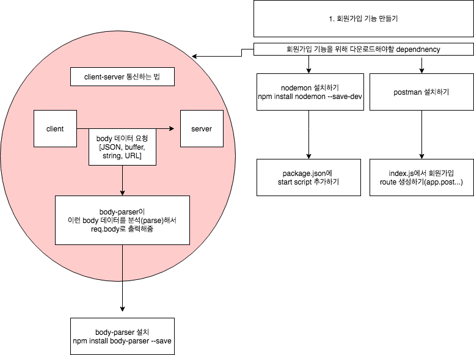

# 1. node로 백엔드 개발하기(3)
*이 내용은 인프런의 '따라하며 배우는 노드 리액트 기초 강의'를 학습한 자료입니다.*



## 1) Bcrypt?
- 현재 데이터베이스상 비밀번호는 안전하지 않은 상태로 저장되어 있다.
- 그래서, Bcrypt를 이용하여, 비밀번호를 암호화한 후 데이터베이스에 저장하려고 한다.

```js
npm install bcrypt --save
```

## 2) Bcrypt로 비밀번호 암호화하기 
### (1) model>User.js

- 비밀번호 암호화를 위해 bcrypt, salt가져오기
- salt를 이용하여 비밀번호를 암호화해야하고, saltRounds는 salt가 몇글자인지 나타낸다.
- saltRounds = 10이라는 말은, 10자리 솔트를 만들어서 -> 이 솔트로 비밀번호를 암호화한다는 말이다.

```js
...

const bcrypt = require('bcrypt');
const saltRounds = 10; 
```

- user모델의 유저 정보를 저장하기 전에(ndex.js에서 user.save()하기 전에) 실행하는 함수를 작성한다.
- function을 사용하여 비밀번호를 암호화한 후, index.js의 user.save()코드 부분으로 가서, save 코드를 진행한다.
 
```js
userSchema.pre('save', function(next){
    var user = this;        //this는 userSchema를 가리킴
    
    //model안의 password를 변경할때만 -> 비밀번호를 암호화한다.
    //(이메일 변경시에는 비밀번호 암호화를 하지 않게 함)
    if(user.isModified('password')){
        bcrypt.genSalt(saltRounds, function(err, salt) {    //솔트만들기
            if(err) return next(err);   
            //err가 나면->next()로 감 : index의 user.save()코드로 감

            // 솔트를 제대로 생성했다면(error가 나지 않았다면?)
            //user.password : 암호화 전 비밀번호 | function(err:에러, hash:암호화된 pw)
            bcrypt.hash(user.password, salt, function(err, hash) { 
                if(err) return next(err);
                user.password = hash;   //유저 비밀번호를 hash값으로 변경
                next();                 //변경 후에는 next를 해서 index.js의 user.save()코드로 돌아감
            });
        });
    }
    //만약 비밀번호를 바꾸는 게 아니라면?
    else{
        next(); //원래대로 진행
    }  
})  

...
```

### (2) index.js의 save 지점
```js
...

// 회원가입을 위한 라우터 만들기
app.post('/api/users/register', (req, res)=>{
    const user = new User(req.body);

    //이지점에서 먼저 models>User.js의 암호화 function이 실행되고 -> save가 다음으로 진행됨
    user.save((err, userInfo)=>{  
        if(err) return res.json({success : false, err}) 
        return res.status(200).json({success : true})
    })  
})


```
