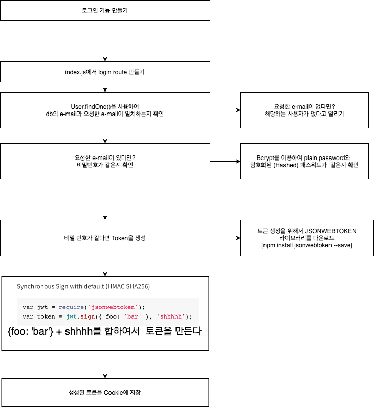

# 1. node로 백엔드 개발하기(4)
*이 내용은 인프런의 '따라하며 배우는 노드 리액트 기초 강의'를 학습한 자료입니다.*



# 로그인 기능을 만들어보자!

## 1) index.js
### (1) login route 만들기
- index.js에서 login route를 생성한다.
- `User.findOne()`을 사용해 database에서 요청한 e-mail(id)를 찾는다.
```js
const cookieParser = require('cookie-parser'); 
//쿠키를 사용하겠다!
app.use(cookieParser());

...

app.post('/api/users/login', (req, res)=>{
  User.findOne({email:req.body.email}, (err, user)=>{
    if(!user){         //만약 userInfo가 없다면?
      return res.json({
        loginSucess : false,
        message : "제공된 이메일에 해당하는 유저가 없습니다."
      })
    }
```
- 데이터 베이스에서 요청한 email이 있다면 비밀번호가 같은 지 확인한다.
- Bcrypt를 이용하여 plain password와 암호화된 (Hashed)패스워드와 같은 지 확인한다.
```js
   
    else{
      //user에 유저에 대한 정보가 다 들어있음
      //comparePassword는 User.js에서 정의한 메소드
      user.comparePassword(req.body.password,(err, isMatch)=>{
        if(!isMatch){  
          return res.json({
            loginSucess : false,
            message : "비밀번호가 틀렸습니다."
          })
        }
```

- 비밀번호가 같다면 token을 생성해준다.
- 해당 토큰을 쿠기에 저장한다. (x_auth는 아무거나 써도 됨)
```js
        else{
          user.generateToken((err, user)=>{  //user에는 토큰이 저장된 상태
            if(err) return res.status(400).send(err);

            //토큰을 쿠키에 저장해보자.
            res.cookie("x_auth", user.token)
            .status(200)
            .json({
              loginSucess : true,
              userId : user._id
            }) 
          })
        }
      })
    }
  })
})

...
```

<br/>

## 2) models>User.js

### (1) JSONWEBTOKEN 설치하기
- 토큰 생성을 위해, jsonwebtoken 라이브러리를 설치한다.
```
npm install jsonwebtoken --save
```
- 아래 코드를 이용하여 토큰을 생성한다.
```js
var jwt = require('jsonwebtoken');
var token = jwt.sign({ foo: 'bar' }, 'shhhhh');
```

<br/>

### (2) jsonwebtoken라이브러리 불러오기
- User.js 제일 상단에 해당 라이브라리를 불러온다.

```js
...
const jwt = require('jsonwebtoken');
```

### (3) 비밀번호 비교 메소드 만들기
- 로그인을 위해, 비밀번호를 비교하는 comparePassword(비번, 콜백함수)메소드이다.
- plainPassword는 화면에서 입력한 값이다.
- this.password은 db에 있는 암호화된 비밀번호이다.
- 현재 db에 저장된 비밀번호는 bcrypt에 의해 암호화된 상태이다.
- 그러므로, 입력한 비밀번호를 -> 암호화하여 -> db에 저장된 암호화된 비밀번호와 비교해야한다.
```js
...
userSchema.methods.comparePassword = function(plainPassword, cb){
    //compare(입력한 비번, db에 저장된 암호화된 비번)
    bcrypt.compare(plainPassword, this.password, function(err, isMatch){
        if(err) return cb(err);
        cb(null, isMatch); //만약 일치한다면->콜백(err=null, isMatch=true)
    })
}
```

<br/>

### (4) 토큰을 생성하는 메소드 만들기
- generateToken은 토큰을 생성하는 메소드이다.
- json web token을 이용하여 토큰을 생성한다.
```js
userSchema.methods.generateToken = function(cb){
    var user = this;
    var token = jwt.sign(user._id.toHexString(), 'secertToken')
    //user._id + secertToken을 합쳐서 -> token을 만드는 코드
    //secertToken을 가지고 -> user._id를 알 수 있음
    user.token = token
    
    user.save(function(err, user){
        if(err) return cb(err);
        cb(null, user);  
        //error가 없다면 -> err=null, user정보를 보냄 
        //-> 이 user정보가 index.js의 generateToken의 user매개변수로 들어감
        
    })
}

...
```


<br/><br/><br/>

-----

#### node를 이용하여 backend 구축하기

- <a href="https://github.com/KumJungMin/boiler-plate/blob/master/descri/node1.md"> 사전설정하기 </a>

- <a href="https://github.com/KumJungMin/boiler-plate/blob/master/descri/node2.md"> 회원가입만들기 </a>

- <a href="https://github.com/KumJungMin/boiler-plate/blob/master/descri/node3.md"> 비밀번호 암호화하기 </a>

- <a href="https://github.com/KumJungMin/boiler-plate/blob/master/descri/node4.md"> 로그인 기능 만들기 </a>

- <a href="https://github.com/KumJungMin/boiler-plate/blob/master/descri/node5.md"> 권한설정 하기 </a>

- <a href="https://github.com/KumJungMin/boiler-plate/blob/master/descri/node6.md"> 로그아웃만들기 </a>

<br/>

#### react를 이용하여 frontend 구축하기

- <a href="https://github.com/KumJungMin/boiler-plate/blob/master/descri/fro/react1.md"> 사전설정하기 </a>

- <a href="https://github.com/KumJungMin/boiler-plate/blob/master/descri/fro/react2.md"> 로그인만들기 </a>

- <a href="https://github.com/KumJungMin/boiler-plate/blob/master/descri/fro/react3.md"> 회원가입만들기 </a>

- <a href="https://github.com/KumJungMin/boiler-plate/blob/master/descri/fro/react4.md"> 로그아웃만들기 </a>

- <a href="https://github.com/KumJungMin/boiler-plate/blob/master/descri/fro/react5.md"> 인증만들기 </a>
