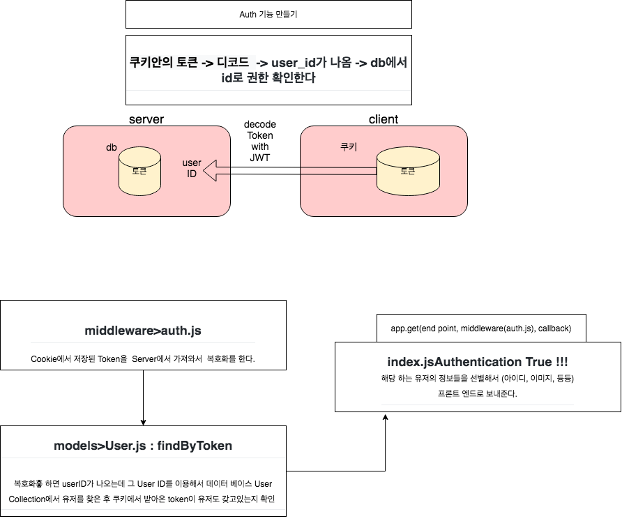

# 1. node로 백엔드 개발하기(5)
*이 내용은 인프런의 '따라하며 배우는 노드 리액트 기초 강의'를 학습한 자료입니다.*



<br/>

# 권한 설정을 해보자!
*페이지 이동 때마다 로그인되있는지 안되어있는지, 관리자 유저인지등을 체크*

*글을 쓸때나 지울때 같은데 권한이 있는지 같은 것도 체크*

## 1) middleware>auth.js
- Cookie에서 저장된 Token을 Server에서 가져와서 복호화를 한다.
```js
const {User} = require('../models/User');

let auth = (req, res, next) =>{
// 인증처리를 하는 곳
// 1. 클라이언트 쿠키에서 토큰 가져오기
    let token = req.cookies.x_auth;  

// 2. 토큰을 복호화해서 user를 찾기->유저모델에서 메소드 만들어서 가져와서 사용하기
    User.findByToken(token, (err,user)=>{
        if(err) throw err;
        if(!user) return res.json({
            isAuth : false,
            error : true
        })

        // 만약 유저가 있다면?
        //req.token에 토큰과 유저아이디값을 넣으면 
        //index.js에서 req.token으로 해당 값을 가져올 수 있기때문
        req.token = token;  
        req.user = user;
        next();  // 미들웨어 작업 후 -> 콜백함수 작업을 하도록 진행시킴
    })
  
// 3. 유저가 있으면 인증ok

}

module.exports = {auth};
```


<br/>

## 2) models>User.js
- findByToken은 토큰이 일치하는지 비교하는 메소드이다.
- 복호화를 하면 User ID가 나온다.
- 그 User ID를 이용해서 데이터 베이스에서 유저를 찾는다.
- 그 다음, 쿠키에서 받아온 token이 유저도 갖고있는지 확인한다. 

```js
...
userSchema.statics.findByToken = function(token, cb){
    var user = this;
    // 복호화과정
    jwt.verify(token, 'secertToken', function(err, decoded){ //decoded:유저id
        //유저 아이디를 이용하여 -> 유저를 찾고 
        //클라이언트에서 가져온 토큰과 db에 보관된 토큰이 일치하는 지 확인
        user.findOne({"_id" : decoded, "token" : token}, function(err, user){
            if(err) return cb(err);
            cb(null, user);
        })
    })
}

```

<br/>

## 3) index.js
- auth route는 사이트에서 권한별로 접근이 가능하게 한다.
- server의 토큰, client의 쿠키안의 토큰을 비교하여 -> 권한을 확인한다.
- 쿠키안의 토큰 -> 디코드 -> user_id가 나옴 -> db에서 id로 권한 확인한다.
- auth는 미들웨어로, auth.js 코드의 작업을 한다.

```js
...
const cookieParser = require('cookie-parser'); 
const {auth} = require('./middleware/auth');

...

// app.get(end point, middleware, callback)
app.get('/api/users/auth', auth, (req,res)=>{

  // 여기까지 미들웨어를 통과했다는 말은, Auth가 true라는 말
  res.status(200).json({  
    //클라이언트에게 보내는 정보
    //정보를 보내주면, 어떤 페이지든지 간에 보낸 정보를 이용할 수 있음
    _id : req.user._id,
    isAdmin : req.user.role == 0 ? true : false,
    isAuth : true,
    email : req.user.email,
    name : req.user.name,
    lastname : req.user.lastname,
    role : req.user.role,
    image : req.user.image 
  })
})

```


<br/><br/><br/>

-----

#### node를 이용하여 backend 구축하기

- <a href="https://github.com/KumJungMin/boiler-plate/blob/master/descri/node1.md"> 사전설정하기 </a>

- <a href="https://github.com/KumJungMin/boiler-plate/blob/master/descri/node2.md"> 회원가입만들기 </a>

- <a href="https://github.com/KumJungMin/boiler-plate/blob/master/descri/node3.md"> 비밀번호 암호화하기 </a>

- <a href="https://github.com/KumJungMin/boiler-plate/blob/master/descri/node4.md"> 로그인 기능 만들기 </a>

- <a href="https://github.com/KumJungMin/boiler-plate/blob/master/descri/node5.md"> 권한설정 하기 </a>

- <a href="https://github.com/KumJungMin/boiler-plate/blob/master/descri/node6.md"> 로그아웃만들기 </a>

<br/>

#### react를 이용하여 frontend 구축하기

- <a href="https://github.com/KumJungMin/boiler-plate/blob/master/descri/fro/react1.md"> 사전설정하기 </a>

- <a href="https://github.com/KumJungMin/boiler-plate/blob/master/descri/fro/react2.md"> 로그인만들기 </a>

- <a href="https://github.com/KumJungMin/boiler-plate/blob/master/descri/fro/react3.md"> 회원가입만들기 </a>

- <a href="https://github.com/KumJungMin/boiler-plate/blob/master/descri/fro/react4.md"> 로그아웃만들기 </a>

- <a href="https://github.com/KumJungMin/boiler-plate/blob/master/descri/fro/react5.md"> 인증만들기 </a>
