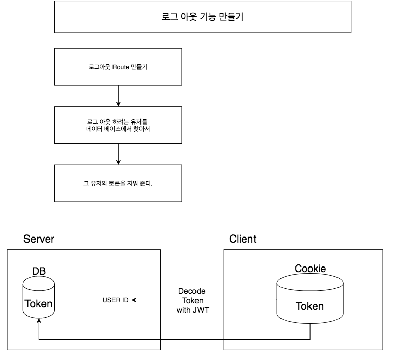

# 1. node로 백엔드 개발하기(6)
*이 내용은 인프런의 '따라하며 배우는 노드 리액트 기초 강의'를 학습한 자료입니다.*



# 로그아웃 기능을 만들어보자

## 1) index.js
### (1) logout route 만들기
- 해당하는 유저를 찾아서 -> 토큰을 지워준다.(토큰은 인증수단이므로 삭제해줘야함)
- 로그인된 상태이므로, auth미들웨어를 넣어준다.
- `findOneAndUpdate`메소드를 이용하여 로그아웃 하려는 유저를 모델에서 찾는다. 
```js
app.get('/api/users/logout', auth, (req, res)=>{
  User.findOneAndUpdate({_id : req.user._id}, 
    //유저를 찾아서 업데이트하는 것
    //req.user는 auth라는 미들웨어에서 인증을 하고 저장한 req.user값을 그대로 사용하는 것
    {token : ""},  //토큰 지워주기
    //콜백함수
    (err, user)=>{
      if(err) return res.json({success : false, err});
      return res.status(200).send({
        success : true
      })
    }
    )  
})
```
<br/>

## 2) middleware>auth.js
- 토큰을 이용한 인증처리를 하는 코드이다.
```js
const {User} = require('../models/User');

let auth = (req, res, next) =>{
// 인증처리를 하는 곳
// 1. 클라이언트 쿠키에서 토큰 가져오기
    let token = req.cookies.x_auth;  

// 2. 토큰을 복호화해서 user를 찾기->유저모델에서 메소드 만들어서 가져와서 사용하기
    User.findByToken(token, (err,user)=>{
        if(err) throw err;
        if(!user) return res.json({
            isAuth : false,
            error : true
        })

        // 만약 유저가 있다면?
        req.token = token;  
        //req.token에 토큰과 유저아이디값을 넣으면 -> index.js에서 req.token으로 해당 값을 가져올 수 있기때문
        req.user = user;
        next();  // 미들웨어 작업 후 -> 콜백함수 작업을 하도록 진행시킴
    })
    

// 3. 유저가 있으면 인증ok

}

module.exports = {auth};
```


<br/><br/><br/>

-----

#### node를 이용하여 backend 구축하기

- <a href="https://github.com/KumJungMin/boiler-plate/blob/master/descri/node1.md"> 사전설정하기 </a>

- <a href="https://github.com/KumJungMin/boiler-plate/blob/master/descri/node2.md"> 회원가입만들기 </a>

- <a href="https://github.com/KumJungMin/boiler-plate/blob/master/descri/node3.md"> 비밀번호 암호화하기 </a>

- <a href="https://github.com/KumJungMin/boiler-plate/blob/master/descri/node4.md"> 로그인 기능 만들기 </a>

- <a href="https://github.com/KumJungMin/boiler-plate/blob/master/descri/node5.md"> 권한설정 하기 </a>

- <a href="https://github.com/KumJungMin/boiler-plate/blob/master/descri/node6.md"> 로그아웃만들기 </a>

<br/>

#### react를 이용하여 frontend 구축하기

- <a href="https://github.com/KumJungMin/boiler-plate/blob/master/descri/fro/react1.md"> 사전설정하기 </a>

- <a href="https://github.com/KumJungMin/boiler-plate/blob/master/descri/fro/react2.md"> 로그인만들기 </a>

- <a href="https://github.com/KumJungMin/boiler-plate/blob/master/descri/fro/react3.md"> 회원가입만들기 </a>

- <a href="https://github.com/KumJungMin/boiler-plate/blob/master/descri/fro/react4.md"> 로그아웃만들기 </a>

- <a href="https://github.com/KumJungMin/boiler-plate/blob/master/descri/fro/react5.md"> 인증만들기 </a>
